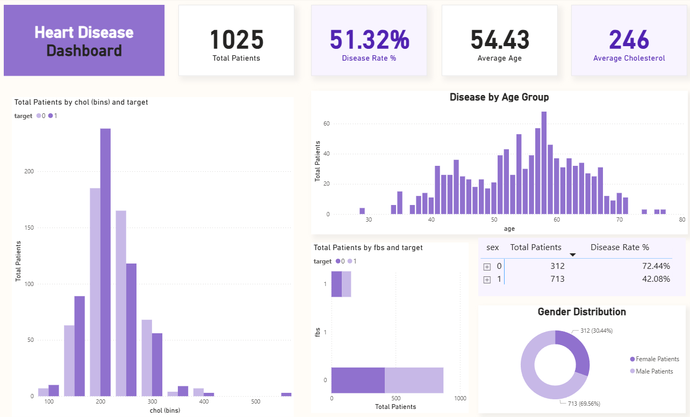

<h3>Heart Disease Dashboard</h3>

  This project presents an analytical dashboard built using Excel and Power BI
  to explore and visualize patterns within a heart disease dataset. The goal of
  this dashboard is to identify key health indicators influencing heart disease
  prevalence, while providing an overview of patient demographics and risk
  factors.

<h3>Objective</h3>

  The primary objective of this analysis is to understand the relationship
  between age, cholesterol levels, fasting blood sugar, gender, and heart
  disease occurrence among patients. The dashboard helps in identifying trends
  and supports data-driven medical insights.

<h3>Tools Used</h3>
<li>Microsoft Excel – for data cleaning and preprocessing</li>
<li>
  Microsoft Power BI – for interactive visualization and dashboard creation
</li>
<h3>Dataset Information</h3>

  The dataset used in this project is a publicly available Heart Disease dataset
  containing attributes such as age, sex, cholesterol level (chol), fasting
  blood sugar (fbs), and target (presence or absence of heart disease). The
  dataset includes 1,025 patient records.

<h3>Dashboard Insights</h3>
<li>Total Patients: 1,025</li>
<li>Disease Rate: 51.32%</li>
<li>Average Age: 54.43 years</li>
<li>Average Cholesterol: 246 mg/dl</li>
<li>Gender Distribution: 69.56% Male, 30.44% Female</li>
<li>
  Disease by Age Group: The highest prevalence is observed between ages 50–60.
</li>
<li>
  Cholesterol Levels: Most patients have cholesterol values between 200–250, and
  higher cholesterol is associated with an increased risk.
</li>
<li>
  Fasting Blood Sugar (fbs): Heart disease is more frequent in patients with fbs
  = 1 (indicating elevated fasting blood sugar).
</li>
<h3>Methodology</h3>
<li>Imported the dataset into Excel for data inspection and cleaning.</li>
<li>Handled missing values and standardized column names.</li>
<li>Loaded the cleaned dataset into Power BI for visualization.</li>
<li>
  Created measures and calculated disease rate, average values, and gender-wise
  distributions.
</li>
<li>
  Designed interactive visuals including histograms, bar charts, and donut
  charts.
</li>
<h3>Key Findings</h3>
<li>
  More than half of the patients in the dataset show signs of heart disease.
</li>
<li>Patients aged between 50 and 60 are most affected.</li>
<li>
  Higher cholesterol levels and high fasting blood sugar correlate with higher
  heart disease rates.
</li>
<li>
  Male patients represent a larger portion of total cases, but females show a
  higher disease rate percentage.
</li>
<h3>Dashboard Preview</h3>

  

<h3>Future Improvements</h3>
<li>Integrate real-time or larger datasets for better generalization.</li>
<li>Incorporate advanced analytics such as predictive modeling.</li>
<li>
  Enhance interactivity with drill-through and slicer features in Power BI.
</li>
<h3>Conclusion</h3>

  This Power BI dashboard provides valuable insights into the relationship
  between key medical indicators and heart disease. It demonstrates how business
  intelligence tools like Power BI can simplify healthcare data interpretation
  and support preventive healthcare strategies.

